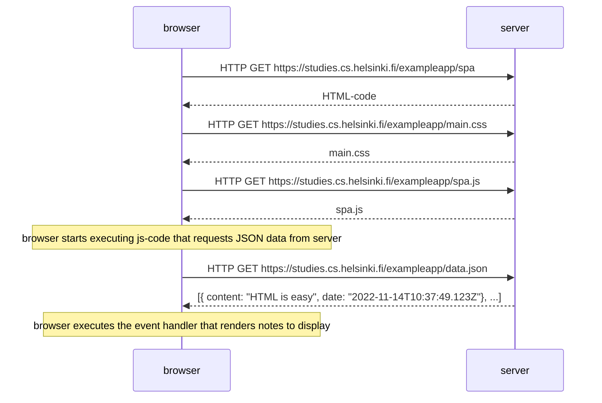

# Exercise 0.5: Single page app

Create a diagram depicting the situation where the user goes to the single page
app version of the notes app at https://studies.cs.helsinki.fi/exampleapp/spa.

# Ilustration

