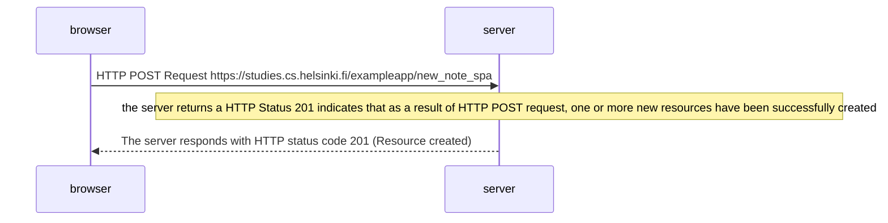

# Exercise 0.6  New note ( SPA )

Create a diagram depicting the situation where the user creates a new note using the
single page version of the app.

```mermaid
 
 sequenceDiagram
browser->>server: HTTP POST Request https://studies.cs.helsinki.fi/exampleapp/new_note_spa


note over server: the server returns a HTTP Status 201 indicates that as a result of HTTP POST request, one or more new resources have been successfully created 

server-->>browser: The server responds with HTTP status code 201 (Resource created)

 
```

# Illustration

